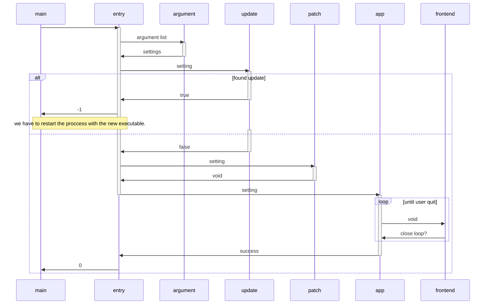

## main
redirects to entrypoint of lib this way end to end tests can be made.

## entrypoint
1. parses start arguments
2. downloads update from github
3. patches programm from old version to new version and cleans up old files
4. run main application

