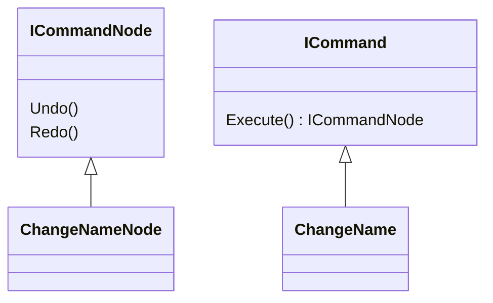

- can be executed
- returns pointer to object that can undo and redo or nullptr if it's an non-undoable change
- returned object stores all the information to undo and redo

- returned object is stored in a stack-like structure to be un and redone
