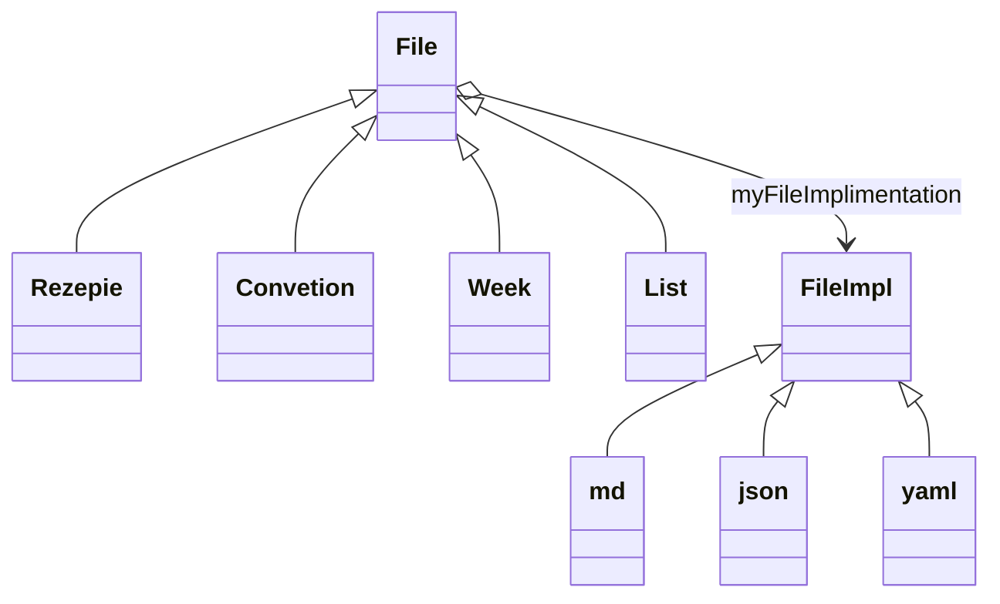

bridge pattern

`IFile` talks to `IFileImpl` to read and write data

different filetypes (e.g. rezept, weekplan, meal) impliment `IFile` and expose an adapted interface

different fileparsers (e.g. md, json, yaml) implement `IFileImpl` to correctly read and write to the file.

the IFileImpl is chosen according to the file ending.

IFileImpl can also be injected for Mocking

example

Open Rezept "rezepte/mainDish/lasangie.md"

Create a rezept object  
whitch talks via its IFile interface  
that creates a md object as it's IFileImpl interface object

